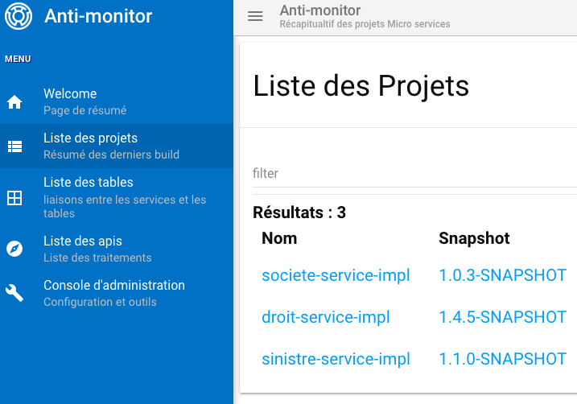

# Anti-Monitor

Un serveur permettant d'agréger des données pour créer un annuaire de micro-service pour une enreprise.



## Build du projet

### Partie front

- Clone the git repository 
- Build la partie front du projet en exécutant les commandes suivantes :
```batchfile
cd web
npm install
npm run build
```

### Partie serveur et jar exécutable

- Build la partie serveur en exécutant dans le répertoire `server` la commande : 
```batchfile
mvn clean install
```

### Image Docker (Optionelle)

- Si vous voulez utilliser Docker, alors toujours dans le répertoire `server` lancer la commande :
```batchfile
mvn dockerfile:build
``` 

## lancer le serveur
Deux manières de lancer le serveur :
- Soit via un jar exécutable 
- Soit via l'image Docker 

### Via le jar exécutable 

Le lancement du serveur s'effectue via la commande suivante : 

```batchfile
java -jar <fichier JAR> -conf <Fichier de configuration>
``` 
avec`
- __fichier JAR__ : l'artifact généré lors la fabrication du serveur présent dans le répertoire `server/target/*-fat.jar
- __Fichier de configuration__ : un fichier de configuration pour paramétrer le serveur (fichier exemple dans `config.json`).

### Via l'image Docker 

Une fois l'image docker sur la machine ou dans le registry, il suffit de lancer la commande suivante :

```batchfile 
docker run -p <Port Cible>:8080 -v <BD NITRITE>:/nitrite -v <LOG DIR>:/logs -t christophegeninnet/antimonitor
``` 
avec :
- __Port Cible__ : Port cible pour l'application.
- __BD NITRITE__ : Répertoire pour la base de données Nitrite.
- __LOG DIR__ : Répertoire des logs de l'application.

